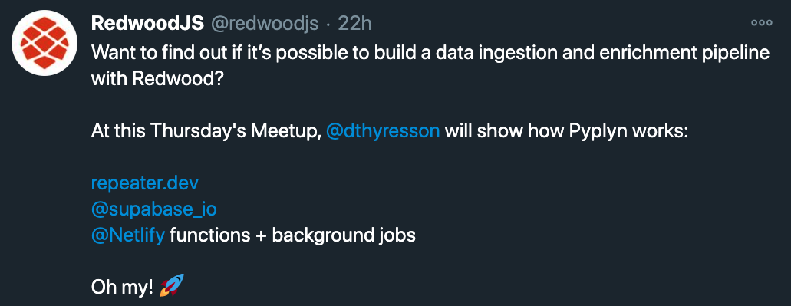
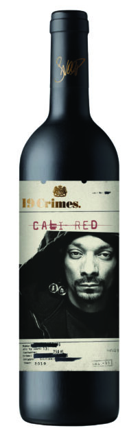
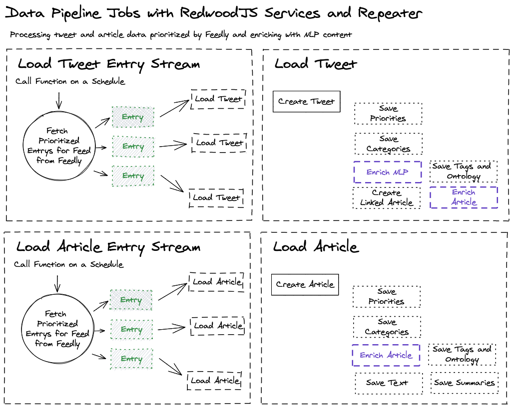
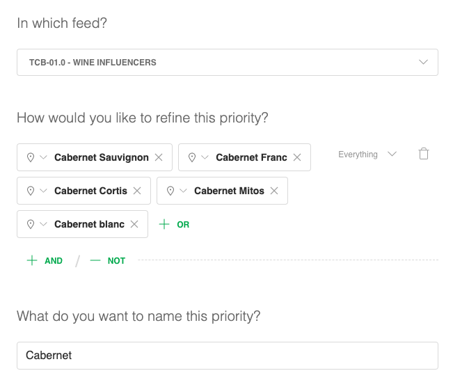
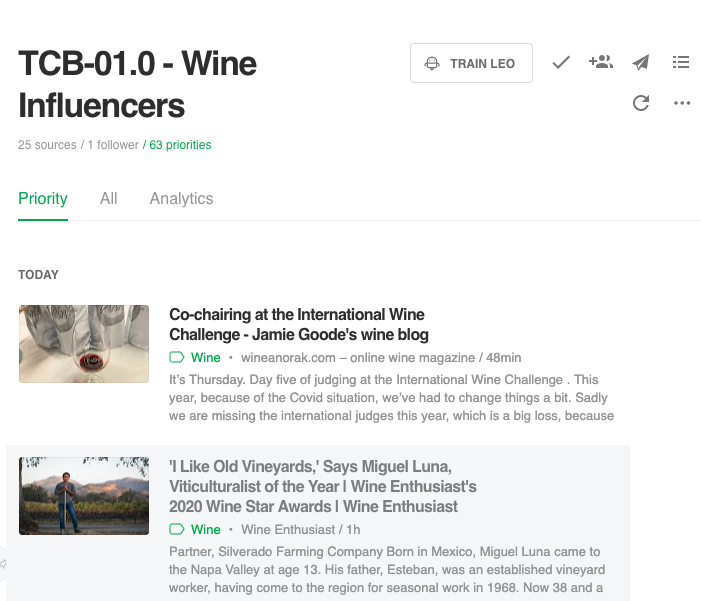
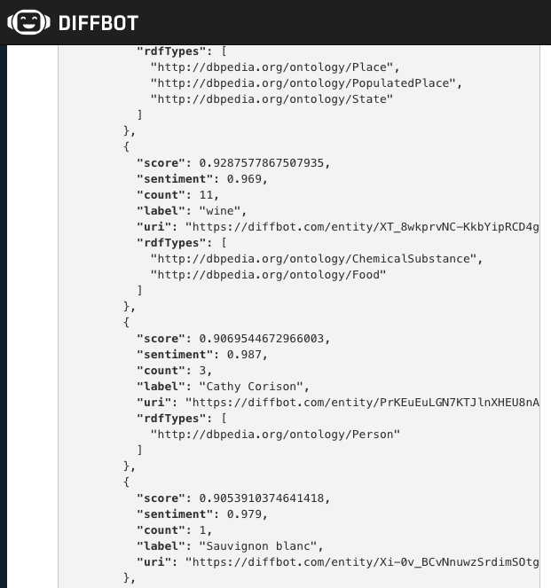

---

# What is pyplyn?

## A data pipeline to curate, prioritize, process and store enriched tweets and mentioned articles for analysis, research and reporting.
## A Jamstack site built using the RedwoodJS framework to orchestrate the jobs, services, and visualize that data.

---

## Proof of concept to take to a client in the wine industry

Twitter is "full" (ok, sometimes) of insightful news and trends. By analyzing curated content you can gain business intelligence:

- 🍷 Identify trends in varietals and brands across the industry which lead to increases in revenue.
- 📈 Answer, why and who is partnering with entertainment industry (e.g. Snoop Dog and Australian wine brand, Klingon Star Trek wine)
- 🔍 Current focus on getting data and rudimentary "analysis"

---

# Why did I make it?
## 🍇 Can Jamstack build a data ingestion pipeline?

---

# 🔬 An Experiment
## How far can I push Jamstack and RedwoodJS?
* 🎉 What works?
* 🤷‍♂️ What doesn't yet?
* 🤔 What would I still need?
* 🎁 What can be better and how?

---

# Can you? Should you? Is it possible?

* 🥳 Have built before (Heroku, Redis, Sidekiq, Clock/Scheduler)
* 😒 Experimented with AWS Serverless and FaunaDB
* 😸 There are many ways to do this, established patterns, especially using AWS.
* 🤷‍♂️ So, what's the answer?

---

# Yes?

---

# What does it do?

## Basic Data Pipeline

* ⛏ Curation
* ⏲ Ingestion (Scheduled Jobs)
* 🧩 Enrichment (Fan out)
* 🎛 Parsing & Transformation (Fan out)
* 💾 Storage
* 🧮  Analysis for Visualizations & Reporting

---
### "Fan-out"

---

# Curation, Ingestion,   Enrichment

---

# Demo Part 1

* Dashboard (Rankings, Stats, Mentions, Comparisons)
* Key Scheduled Jobs (Active and All)
* Tweets and Articles
* Trigger Reprocessing locally to show logs
* While we wait for jobs to run ...

---

# How is it built?

---

# J-amstack

---

# j-A-mstack

![inline, 100%]
(logos/netlify.png)

---

# ja-M-stack

---

# Demo Part 2

* Show notifications
* Look at reprocessed Tweet and Article
* Show Priority and Calendar Charts
* Show completed jobs
* Purge jobs

---

# What works and is important?

* Repeater with functions, libs, and RedwoodJS services
* pMap and Retry and Delay for async fan-out
* Signing function with payload and header JWT
* AWS Serverless -> Netlify Background Jobs (some > 60s)
* Logflare & Pino provide critical visibility (Redaction)
* Charts using Prisma rawSQL and SDL (Bump, Calendar, etc)
* Prisma upserts (prevent/reduce data collisions, loss)

---

# What can be better?

* 202 Async with Netlify less than optimal
* Visibility (logs, errors, retries)
* RedwoodJS log client support (working on it!)
* Pattern for scheduling with function auth/signature
* Apollo polling vs subscriptions for notification & updates

---

# Ideas for how?

* Webhooks? Like Netlify does on deploy, forms, identity?
* Send back stats (stats, duration)
* Support pluggable log service & client (Pino, Logflare)
* Add Prisma upsert to "CRUUD" generators
* RedwoodJS IDE filter `-background.js` functions as "jobs"

---

# 🍾 How did RedwoodJS make it possible?

* 🧠 Framework
* 🌟 Sides (web and api)
*  Services w/in api
* 🥡 Functions effectively became "jobs" side
* SDL & GraphQL w/ Cells made Charts a snap
* Needs a name!
